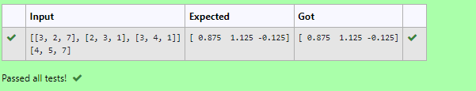

# LU Decomposition 

## AIM:
To write a program to find the LU Decomposition of a matrix.

## Equipments Required:
1. Hardware – PCs
2. Anaconda – Python 3.7 Installation / Moodle-Code Runner

## Algorithm:
### Step 1:
Import numpy library using import statement. 2.From scipy package import lu().

### Step 2:
Get input from user and pass it as an array.

### Step 3:
Get P,L,U matrix using lu(). 5.Print L and U matrix.

### Step 4:
End Program

## Program:
~~~
(i) To find the L and U matrix

Program to find the L and U matrix.
Developed by: Sarankumar J
RegisterNumber: 21500780

import numpy as np
from scipy.linalg import lu
np.array 
A = eval(input())
P,L,U=lu(A)
print(L)
print(U)

(ii) To find the LU Decomposition of a matrix

Program to find the LU Decomposition of a matrix.
Developed by: Sarankumar J
RegisterNumber: 21500780

import numpy as np
from scipy.linalg import lu_factor , lu_solve
A = eval(input())
B = eval(input())
lu,piv=lu_factor(A)
x=lu_solve((lu,piv),B)
print(x)

~~~
## Output:

## Result:
The program to find the LU Decomposition of a matrix is written and verified using python programming.

